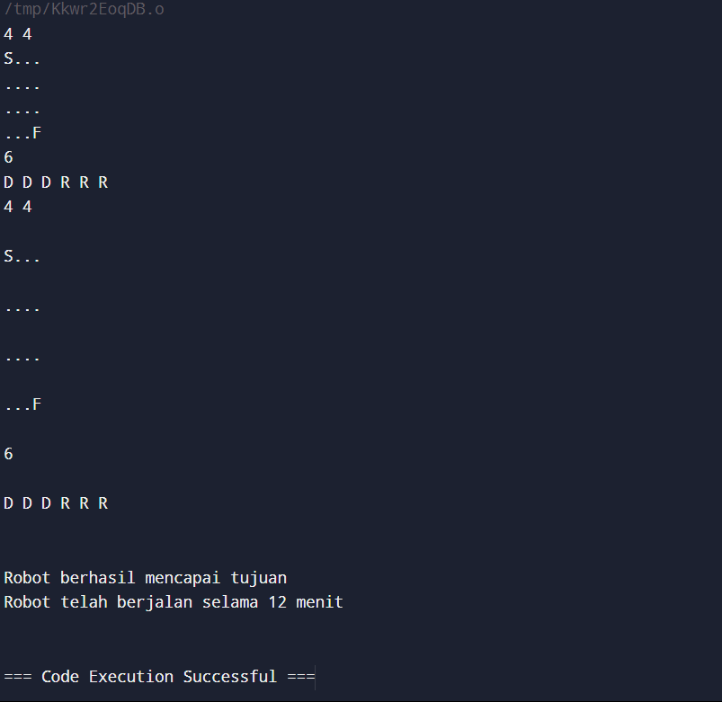
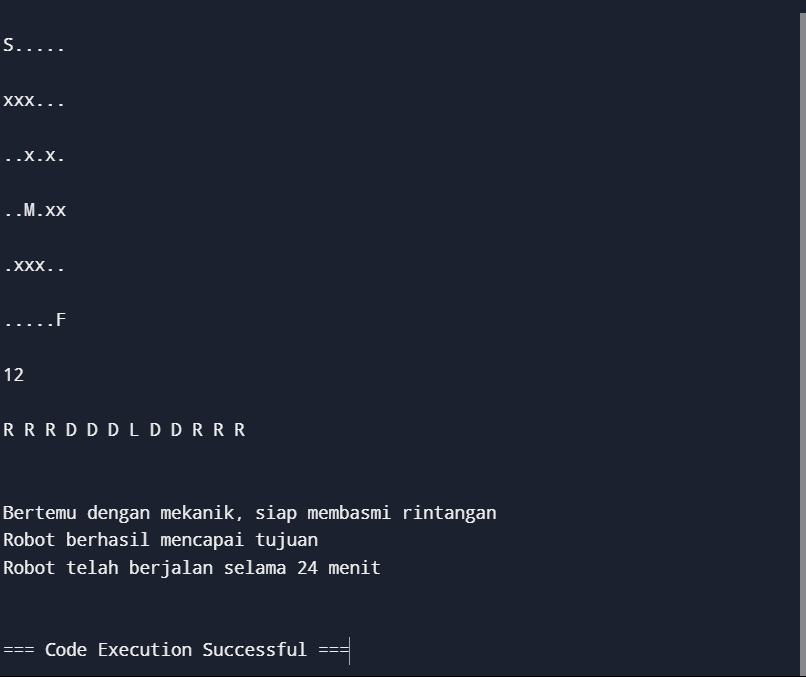
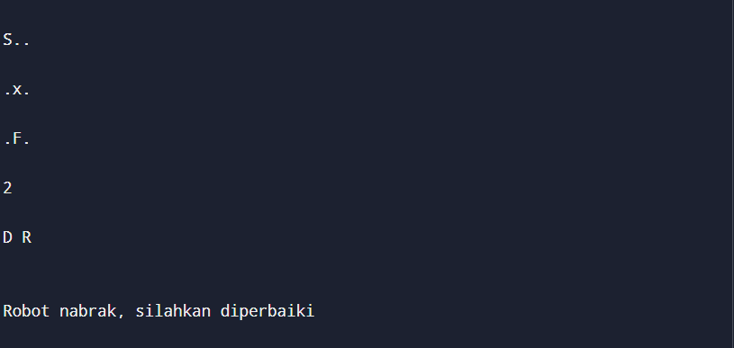
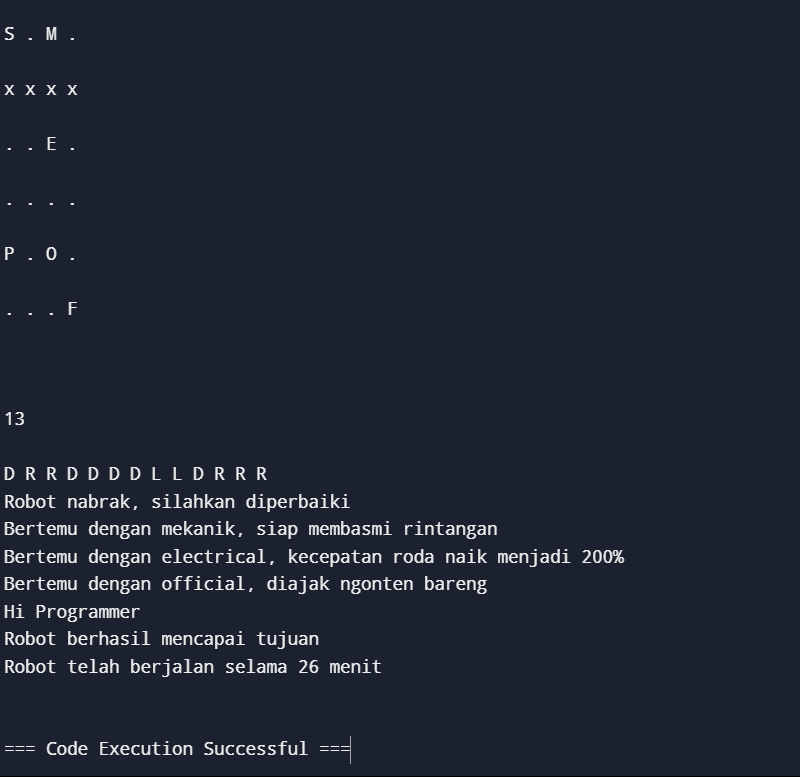
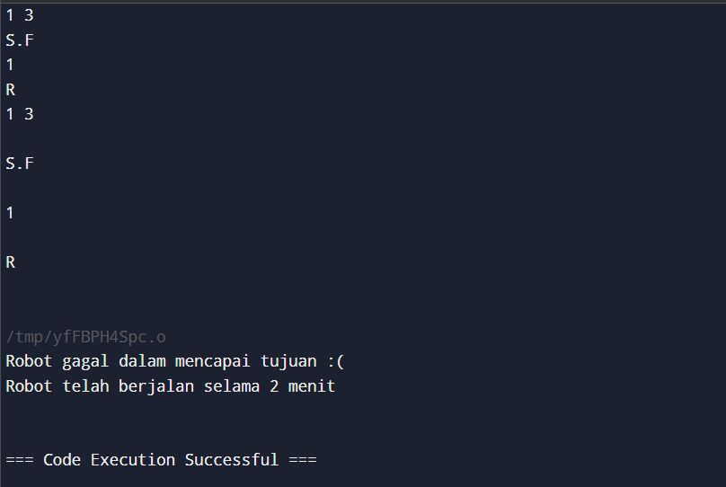

# Solution For Probset KPP PROGRAMMING ROBOTIK 2024

### 1. Test Case 1

**INPUT:**
```
4 4
S...
....
....
...F
6
D D D R R R
```

**EXPECTED OUTPUT:**
```
Robot berhasil mencapai tujuan
Robot telah berjalan selama 12 menit
```

**PROGRAM OUTPUT:**



### 2. Test Case 2

**INPUT:**
```
6 6
S.....
xxx...
..x.x.
..M.xx
.xxx..
.....F
12
R R R D D D L D D R R R
```

**EXPECTED OUTPUT:**
```
Bertemu dengan mekanik, siap membasmi rintangan
Robot berhasil mencapai tujuan
Robot telah berjalan selama 24 menit
```

**PROGRAM OUTPUT:**



### 3. Test Case 3

**INPUT:**
```
3 3
S..
.x.
.F.
2
D R
```

**EXPECTED OUTPUT:**
```
Robot nabrak, silahkan diperbaiki
```

**PROGRAM OUTPUT:**



> masih ada bug dimana saya menggunakan `exit(1)` untuk exit program ketika print 'Robot nabrak, silahkan diperbaiki', akan tetapi jika saya menggunakan `exit(1)` **Test Case 5** bakal gagal karena program exit with error

### 4. Test Case 4

**INPUT:**
```
6 4
S . M .
x x x x
. . E .
. . . .
P . O .
. . . F

13
D R R D D D D L L D R R R
```

**EXPECTED OUTPUT:**
```
Robot nabrak, silahkan diperbaiki
Bertemu dengan mekanik, siap membasmi rintangan
Bertemu dengan electrical, kecepatan roda naik menjadi 200%
Bertemu dengan official, diajak ngonten bareng
Hi Programmer
Robot berhasil mencapai tujuan
Robot telah berjalan selama 26 menit
```

**PROGRAM OUTPUT:**



### 5. Test Case 5

**INPUT:**
```
1 3
S.F
1
R
```

**EXPECTED OUTPUT:**
```
Robot gagal dalam mencapai tujuan :(
Robot telah berjalan selama 2 menit
```

**PROGRAM OUTPUT:**

